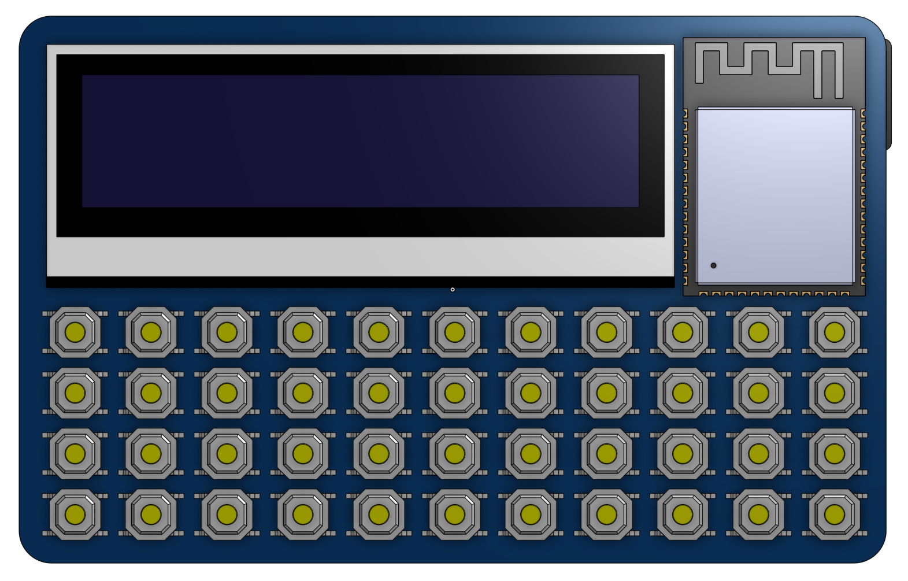
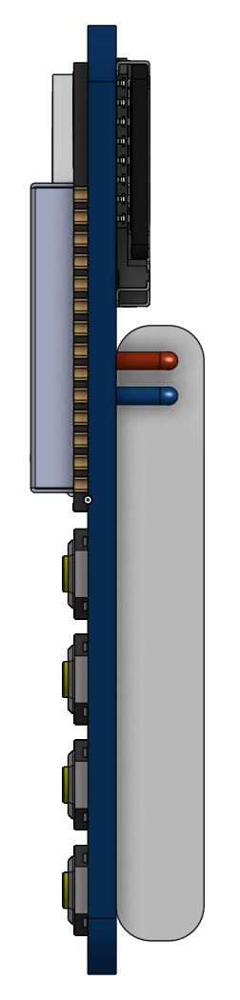
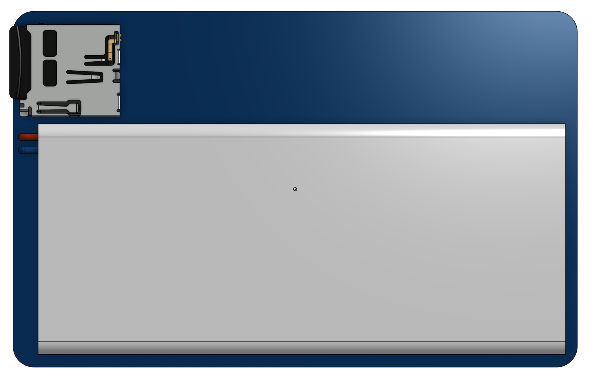

# DataSlice

A credit card-sized computer for wireless and wired communication debugging

---

## 🔖 Overview

The project is inspired by the [M5Stack Cardputer](https://docs.m5stack.com/en/core/Cardputer%20V1.1).

The key features of the DataSlice:

- Credit card size to easily fit in any pocket
- QWERTY tactile keyboard for easy and fast command and data input
- "Large" 2.2-inch OLED monochrome LCD with 128x32 resolution. It is monochrome and has less resolution than M5Stack, but it is larger and fits nicely for text terminal data
- ESP32 module as a central processing unit capable of Bluetooth and WiFi communication
- SD card slot for Data storage
- Large and slim battery for long-term operation
- RS-232, UART, SPI, I2C I/O for wired communication debugging
- CC1101 and LoRa transceivers for wireless communication debugging

---

## 📁 Repository Contents

| File | Description |
|------|-------------|
| `DataSliceHW` | Folder containing the KiCAD project for the DataSlice PCB and Schematic |
| `images` | Folder containing the concept renders | 
| `LICENSE` | This repository license file |
| `README.md` | This file |

---

## 📬 Contributing

You may submit pull requests or fork the repo. But since it is a hobby project, I may respond with significant delays

---

## 🌸 License

Licensed under the [Flower License](./LICENSE) 🌸
